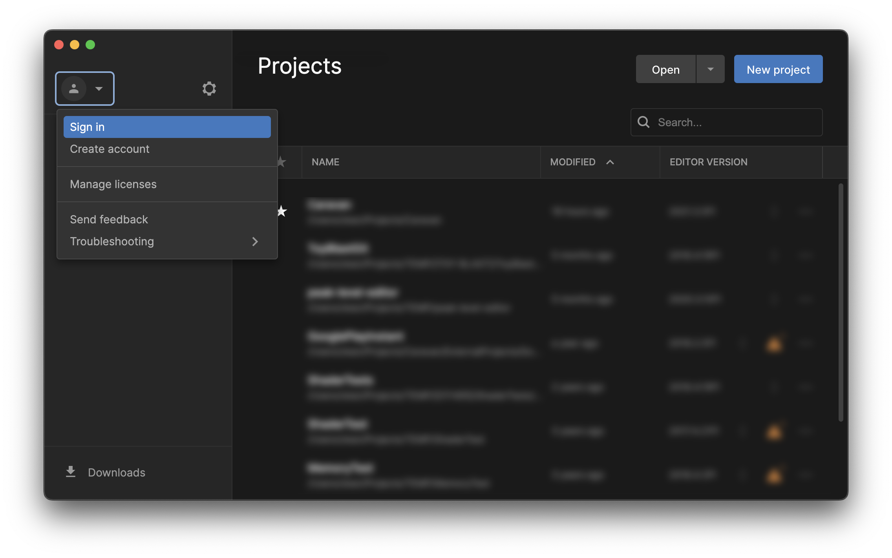
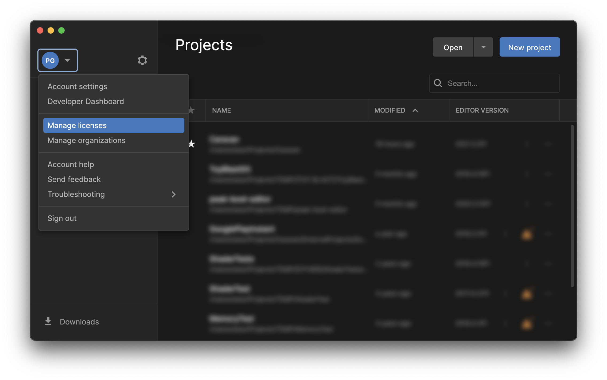
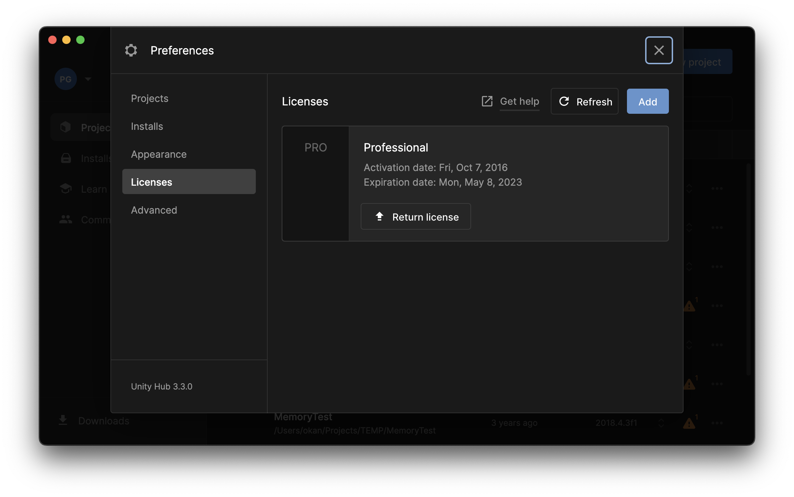
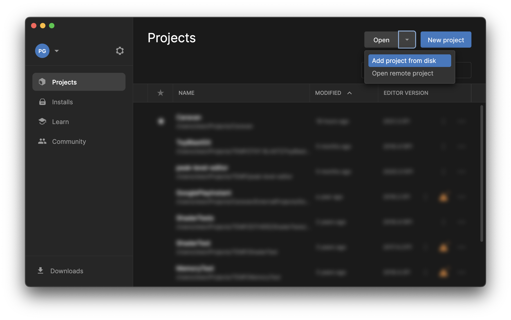
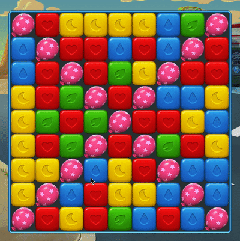
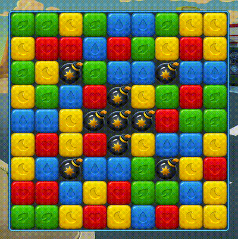

# **UNITHON ENGINEERING 2022**

### GitHub Desktop Açılışı

Aşağıdaki adımları uygulayarak sizin için hazırlamış olduğumuz projeyi kendi bilgisayarınıza çekin:

1. Bilgisayarınızda kurulu olan **GitHub Desktop** uygulamasını açın.
2. **Sign into GitHub.com** ile GitHub.com'a bağlanın.
3. Menüden `File -> Clone Repository`'i seçin.
4. Açılan dialog içinden **GitHub.com** sekmesini seçin.
5. **PeakUnithon22** altında listelenen kendi takımınıza ait **Unithon-Case-Group-X** projesini seçin.
6. LocalPath olarak önerilen dizini kopyalayın.
7. **Clone** butonuna tıklayın.

### Unity Açılış

Aşağıdaki adımları uygulayarak clone'ladığınız projeyi Unity ile açın:

1. Bilgisayarınızda kurulu olan **Unity Hub** uygulamasını açın.
2. Sol üstteki **Unity Id** butonuna tıklayıp açılan pencereden **Sign-in** butonuna tıklayarak Sign-in penceresini açın. 
3. Unity kullanıcınız var ise 5. adıma geçin. Yoksa **create account** linkine tıklayarak kendinize bir **Unity ID** yaratın.
4. Email adresinize gelen `Confirmation maili` ile Unity kullanıcınızı onaylayın.
5. Unity Hub uygulaması üzerinden **Sign in** butonuna tıklayarak Unity'e giriş yapın.
6. Sol üstteki account butonuna tıkladıktan sonra "Manage Licenses" seçeneğine tıklayın.
7. Açılan pencereden **Activate New License** butonuna tıklayıp lisans olarak"**X4-N7JF-PBPJ-D6N8-YEU3-PABY**" girin.
    
8. Project sayfasında **Open** butonuna tıkladıktan sonra az önce cloneladığınız proje dizinine gidin ve içinde bulunan **Unithon** klasörünü seçin.
    
9. Proje Unity Hub'a eklendikten sonra versiyon bölümünde 2021.3.5f1 yazmıyorsa `Select a version` yazan bölüme tıklayarak bu versiyonu seçin.
10. Projenin üzerine tıklayarak açın.
11. Unity açıldıktan sonra Game sekmesine tıklayarak Game penceresini açın.
12. Üst tarafta Free Aspect seçeneğine tıklayın ve alttaki &quot;+&quot; butonuna basın. Çıkan menüden Label bölümüne 9:16 yazın. Type olarak &quot;Aspect Ratio&quot; seçin. Width&amp;Height için sırasıyla 9 ve 16 sayıları girin.
13. Project alanında Scenes altında LevelScene sahnesini çift tıklayarak açın.
14. Hierarchy penceresindeki Level GameObject'inin üzerine tıkladıktan sonra Inspector penceresindeki Current Level menüsünden istediğiniz Level'ı seçin.
15. Play butonuna tıklayarak LevelScene'i çalıştırın.

## Level 0 - Hazır Çalışan Kısım

Sahneyi açtığınızda büyük bir kare göreceksiniz, bu kareye dokümanda ve kod içinde **Board** diyoruz.

Board kendi içinde 9x9=81 adet küçük karelere bölünmüştür, bu küçük karelere ise **Cell** diyoruz.

Her bir cell içinde ise rastgele şekilde dağılmış değişik renklerde küpler olduğunu göreceksiniz. Bu küplere **CubeItem** diyoruz. Bir cell içinde mutlaka CubeItem bulundurmak zorunda değildir, boş kalabilir veya içine başka çeşit bir Item alabilir.

Küplere dokunulduğunda ( **tap** edildiğinde), eğer küpler renklerine göre eşleşiyorlarsa ( **match** ediyorlarsa), patladıklarını ve yerlerine bir üzerlerindeki patlamayan küplerin düştüğünü görebilirsiniz. Board içindeki bu düşme işlemine **Fall** diyoruz.

Yok olan küplerin yerine yeni küpler yaratılır. Bu yeni küpler ise board'un en üstünden board'un içine düşerler. Bu küpler daha yeni yaratıldıkları ve board'a dışarıdan girdikleri için bu işleme fall'dan farklı olarak **Fill** diyoruz.

Bu bahsettiklerimiz kodun içinde hazır ve çalışıyor halde bulunuyor. Bir sonraki bölümde açıklayacağımız görevleri bu kodun üzerine geliştirme yaparak ve/veya bu kod üzerinde değişiklik yaparak tamamlamanızı bekliyoruz.

### Görevler

Görevleri yaparken dikkat etmeniz gereken bazı noktalar var:

- Tüm isteklerimizin eksiksiz ve hatasız çalışıyor olması gerekiyor.
- Bu projenin uzun soluklu gerçek bir oyun olduğunu düşünerek geliştirme yapmanız gerekiyor.
- Yazdığınız kodun temiz ve başkaları tarafından rahatça anlaşılır olması gerekiyor.
- Görevleri takım olarak, beraber tamamlamanız gerekiyor.

Bu noktaların hepsini değerlendirme kriterleri başlığı altında görebilirsiniz.

Görevleri yaparken ihtiyacınız olan tüm görselleri biz önceden hazırladık ve kod ile birlikte projenin içine ekleyerek sizin kullanımınıza hazır hale getirdik. İhtiyacınız olan bütün görseller projede mevcuttur.

## Level 1 - CrateItem

İlk ana görevimiz birbiri ile bağlantılı üç alt görevden oluşuyor. Tüm bu alt görevlerin amacı önceden kısmen hazırlanmış bir item’a eksik olan bazı özelliklerin eklenmesi. Bu item’a **CrateItem** diyoruz.

### 1. CrateItem’ın Sabitlenmesi
Sahneyi açıp, küpleri patlattığınızda CrateItem’ın da aynı küpler gibi düştüğünü göreceksiniz. Bu görevde CrateItem’ın sabit kalmasını sağlamanızı bekliyoruz. Altında bir küp patladığında CrateItem düşmeyecek ve altındaki cell’ler de boş kalacaklar.

### 2. CrateItem’ın Yanında Yapılan Match Sonucu Patlaması
Fark ettiyseniz CrateItem’a dokunduğunuzda, item tepki vermiyor, küpler gibi patlamıyor. Burada CrateItem’a komşu olan CubeItemlar match sonucu patlatıldığında, CrateItem’ın da bundan etkilenerek patlamasını bekliyoruz.

### 3. CrateItem’ı İki Katlı Yapılması
CrateItem’ı iki katlı yaparak patlamasını zorlaştırmak istiyoruz. CrateItem’ın ilk patlamada bir katının azalmasını, ikinci patlamada ise yok olmasını bekliyoruz.

## Level 2 - BalloonItem

İkinci ana görevimiz birbiri ile bağlantılı üç alt görevden oluşuyor. Bu görevlerin amacı level’da tanımlı ancak henüz kodu yazılmamış olan BalloonItem’ı sıfırdan geliştirmek.

### 1. BalloonItem’ının Sıfırdan Geliştirilmesi
BalloonItem sınıfının geliştirilerek level’da tanımlı balonların görünmesini sağlamanızı bekliyoruz.

### 2. BalloonItem’ın Yanında Yapılan Match Sonucu Patlaması
BalloonItem’a dokunduğunuzda, item tepki vermiyor, küpler gibi patlamıyor. Burada BalloonItem’a komşu olan CubeItem match sonucu patlatıldığında, BalloonItem’ın da bundan etkilenerek patlamasını bekliyoruz.

### 3. BalloonItem’ın Fill Etmesi
BalloonItem’larının CubeItem gibi fill etmesini sağlamanızı bekliyoruz. Bunu yaparken %10 ihtimalle BalloonItem, %90 ihtimalle CubeItem düşürmenizi bekliyoruz.

## Level 3 - ColorBalloonItem

Üçüncü ana görevimiz birbiri ile bağlantılı dört alt görevden oluşuyor. Tüm bu alt görevlerin amacı önceden kısmen hazırlanmış bir item'a eksik olan bazı özelliklerin eklenmesi. Bu item'a **ColorBalloonItem** diyoruz.

### 1. ColorBalloonItem Sıfırdan Geliştirilmesi
ColorBalloonItem sınıfının geliştirilerek level’da tanımlı balonların görünmesini sağlamanızı bekliyoruz.

### 2. ColorBalloonItem'ın Yanında Match Yapıldığında Patlatılması
ColorBalloonItem'ların yanlarında herhangi bir match yapıldığında patlamalarını bekliyoruz.

### 3. ColorBalloonItem'ın Görselinin Düzeltilmesi
Sizden ColorBalloonItem'ların match tiplerine göre doğru renkte görünmesini sağlamanızı bekliyoruz.

### 4. ColorBalloonItem'ın Kendi Rengiyle Patlatılması
Bu adımda ColorBalloonItem'ların yanlarında **kendi renkleriyle** match yapıldığında patlamalarını bekliyoruz.

## Level 4 - BombItem

Dördüncü ana görevimiz de birbiri ile bağlantılı dört alt görevden oluşuyor. Bu görevlerin amacı komşu item’ları patlatabilen ve match sonucu yaratılan BombItem’ı sıfırdan geliştirmek.

### 1. BombItem’ının Sıfırdan Geliştirilmesi
BombItem sınıfının geliştirilerek level’da tanımlı bombaların görünmesini sağlamanızı bekliyoruz.

### 2. BombItem’ının Üzerine Basılınca Aktive Edilmesi
Bu görevde, BombItem üzerine dokunulduğunda aktive olarak etrafındaki tüm item’ları etkilemesini bekliyoruz. Etkilenen item bomba ise aktive olmalı, iki katlı ise bir katı azalmalı veya bir katlı ise patlamalı.

### 3. BombItem’ının Diğer Küplerden Oluşturulması
Yedi veya daha fazla küp içeren bir match yapıldığında küplerin patlamasına ek olarak, dokunulan küpün olduğu yerde BombItem oluşması bekliyoruz.

### 4. BombItem Yaratabilecek Küplerin Kullanıcıya İpucu Vermesi
Bu görevde, yedi veya daha fazla küp içeren match’deki küplerin görsellerini, bomba oluşturma ipucu verecek şekilde değiştirmenizi bekliyoruz.

# Değerlendirme

Tüm görevlerin doğru bir şekilde birbirleri ile düzgün çalıştığını deneyebileceğiniz bir test level hazırladık. Bu test level’da tüm item’lar var, ve tüm mekanizmalar doğru şekilde geliştirildiyse sorunsuz çalışıyor olmalı. Kendi testlerinizi bu test level üzerinden deneyebilirsiniz.

Sizin takımınız ile yapacağımız Code Review esnasında
* Test Level üzerinden her görevin doğru çalıştığını kontrol edeceğiz.
* Yazmış olduğunuz kodu her bir görev için, aşağıdaki kriterler ışığında sizinle beraber inceleyeceğiz.

### Değerlendirme Kriterleri
Değerlendirmelerimizi bu dört ana kriter üzerinden yapacağız.

* **COMPLETENESS** - Her görevin hatasız olarak çalışıyor olması.
* **EXTENSIBILITY** - Eklenen veya değiştirilen her kod parçasının, bu oyuna yeni özellikleri ve item’ları eklemeye uygun olması. 
* **READABILITY** - Kodun temiz ve anlaşılır olması. 
* **TEAMWORK** - Görevlerin beraber çalışarak yapılması. Birlikte kod yazarak veya iş bölümü yaparak çıkan sonuçta herkesin katkısı olması.
